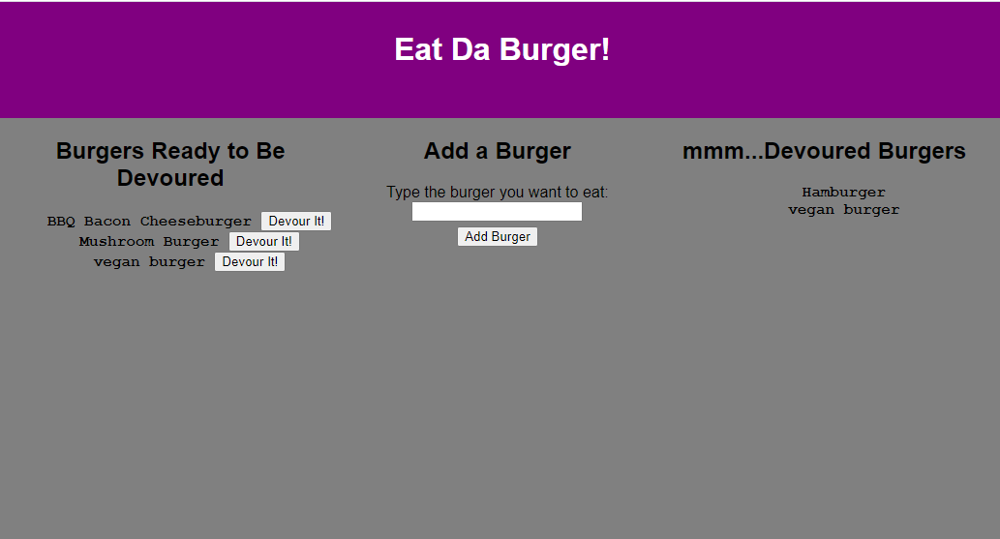
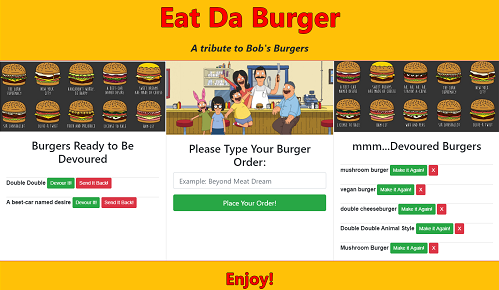
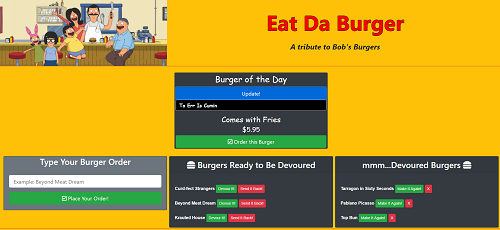
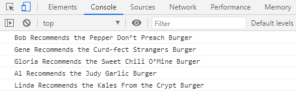

# Eat Da Burger!
[](https://opensource.org/licenses/MIT)
[](https://github.com/jessicablank/eat-da-burger/issues)
[](https://github.com/jessicablank/eat-da-burger/stargazers)


[:hamburger: Deployed on Heroku: https://secure-shore-09876.herokuapp.com/](https://secure-shore-09876.herokuapp.com/)

## Description:  
 A fan site for the show Bob's Burgers. I invite you to learn more and possibly contribute a random burger or Belcher family member. 

 ## Table of Contents:
* [Project Story](#project-story)
* [Contributing](#contributing)
* [Local Installation](#local-installation-instructions)
* [File Structure](#file-structure)
* [Technologies Used](#technologies-used)
* [Questions](#questions)
* [License](#license-info)

## Project Story
### MVP
This project started as a coding bootcamp assignment for a restaurant application. The minimum requirements were:
- User inputs the name of the burger they would like to eat.
- All inputted burgers are stored in a mySQL database. 
- When a user submits a burger's name, the burger will be displayed on the left side of the page waiting to be devoured. 
- Each waiting burger will have a `devour it!` button. When the user clicks the button, the burger will move the right side of the page. 

The reason it's called "Coding Bootcamp" and not "Coding Fun Times" is because the course moves _fast_. We would learn a new concept - in this case mySQL and NPM Handlebars.js - and submit a homework assignment using those concepts a few days later. As a result, my homework submissions often just met the Minimum Viable Product (MVP) requirements. After bootcamp classes ended, I decided to take some time to go back to improve my favorite homework assignments. 

### CRUD
The first improvement for this homework assignment was to add full database functionality. The MVP I submitted did not have a "delete" function. This means my project did not fulfill the full lifecycle of CRUD (Create Read Update Delete). Fortunately I fulfilled the project requirements. Unfortunately, a user could submit an untoward burger name on my deployed application and everyone who visited the site would be able to read it :flushed: In fact, after I added the delete function this very scenario played out. No, I won't tell you the inappropriate (but hilarious) burger name I discovered all over my project on a Wednesday morning. You can ask me via email.

Now the refactored application had full CRUD capabilities:
 - CREATE: Order a burger
 - READ: The burger will appear in the "Burgers Ready to Be Devoured" column by default. Once updated, the burger may appear in the "mmm..Devoured Burgers" column.
 - UPDATE: The user can move the burger between columns via the *Devour It* and *Make It Again* buttons.
 - DELETE: The user can delete the burger from the database via the *Send It Back!* and *X* buttons. 

  I updated the styling and added pictures from Bob's Burgers. I showed the project to my friends to test it. They were impressed, but stumped. I thought the Burger of the Day art images would inspire users to type a clever burger name. Instead, the burger names on the images were difficult to read and intimidated the users. Users felt pressure to come up with a clever burger name on their own. Watching the users struggle also showed me that every time the page refreshed to move a burger, the images flashed awkwardly. Back to refactoring.

 ### FINAL
 The first improvement was to remove the Burger of the Day art. I moved the remaining image into the header so it's not as distracting when the page reloads.
 
 Next, I created a random burger generator and styled it to look like the iconic chalkboard from the show. I added functionality for users to either type their own burger name or order the burger from the _Burger of the Day_ board. During this process I added a little Easter Egg to the console because I am a new developer and I find console messages magical. 

 To test these updates, I texted the app link to a friend and his response was "I love this!" Phew! I asked a few other friends to test and received positive feedback. I feel good about letting this be the final version (for now).
 
Here are screenshots of the MVP, the CRUD, and the FINAL. 


#### MVP:



#### CRUD:



#### FINAL:



### Easter Egg


    
## Contributing
I invite you to contribute Random Burgers from the show for the _Burger of the Day_ board. The `RandomBurgerNames` array is in the **randomBurger.js** file. Please keep the names in alphabetical order. 

In the same file, there is also a `belcherNames` array available for contributions to my silly Easter Egg in the console.

I will be reviewing all of the submissions proposed through Pull requests. I would like to keep these clean, fun, and related to the show. 

## Local Installation Instructions
Clone the repo and install dependencies in terminal using `npm i`

You can use `npm start` to get the app running on localhost:8080

## File Structure
This project uses a custom ORM (Object Relational Mapper) to connect the code to the mySQL database. 
```
├── config
|  ├── connection.js
|  └── orm.js
├── controllers
|  └── burgersControllers.js
├── db
|  ├── schema.sql
|  └── seeds.sql
├── models
|  └── burger.js
├── package-lock.json
├── package.json
├── public
|  └── assets
|     ├── css
|     |  └── style.css
|     ├── img
|     |  ├── BurgerFamily.jpg
|     |  └── favicon.ico
|     └── js
|        ├── burgers.js
|        └── randomBurger.js <--^-^--Contribute Here!!!-^-^-->
├── README.md
├── screenshot.PNG
├── screenshotv2.PNG
├── screenshotv3.PNG
├── server.js
└── views
   ├── index.handlebars
   ├── layouts
   |  └── main.handlebars
   └── partials
      └── burgers
         └── burger-block.handlebars
```
## Technologies Used
- [BootStrap](https://getbootstrap.com/docs/4.0/getting-started/introduction/)
- [NPM HandleBars](https://www.npmjs.com/package/handlebars)
- [NPM MySQL](https://www.npmjs.com/package/mysql)
- [NPM Express](https://www.npmjs.com/package/express)
- [NPM Express-HandleBars](https://www.npmjs.com/package/express-handlebars)


## Questions
You can reach the author, Jessica Blankemeier via [jessicablankemeier@gmail.com](mailto:jessicablankemeier@gmail.com)


## License
Copyright 2020 - present Jessica Blankemeier.
This project is licensed under the terms of the MIT license. 
This page has no license or affiliation with Fox entertainment and is for fan fun use only. 
More information is available at [opensource.org/licenses](https://opensource.org/licenses/MIT)