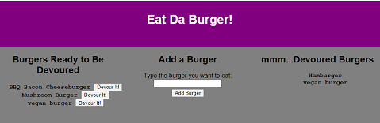

# Eat Da Burger!
[](https://opensource.org/licenses/MIT)
[](https://github.com/jessicablank/eat-da-burger/issues)
[](https://github.com/jessicablank/eat-da-burger/stargazers)


[:hamburger: Deployed on Heroku: https://secure-shore-09876.herokuapp.com/](https://secure-shore-09876.herokuapp.com/)

## Description:  
 A fun way to demonstrate database Create, Read, Update, and Delete with a tribute to Bob's Burgers! Order a burger, send it back, devour it, order it again, and delete it.

 Originally a homework assignment for web-development bootcamp, now a fun project to keep mySQL skills fresh.

### Updated Application After Refactoring:


### Original MVP:


    
## Table of Contents:
* [Local Installation](#local-installation-instructions)
* [Technologies Used](#technologies-used)
* [Tests](#tests)
* [Questions](#questions)
* [License](#license-info)

## Local Installation Instructions
Clone the repo and install dependencies in terminal:
```
npm i

``` 
## Technologies Used
- [BootStrap](https://getbootstrap.com/docs/4.0/getting-started/introduction/)
- [NPM HandleBars](https://www.npmjs.com/package/handlebars)
- [NPM MySQL](https://www.npmjs.com/package/mysql)
- [NPM Express](https://www.npmjs.com/package/express)
- [NPM Express-HandleBars](https://www.npmjs.com/package/express-handlebars)


## Tests
- WHEN the user submits a burger's name, THEN the app will display the burger on the left side of the page.
- WHEN The user clicks on the "Devour it" button, THEN correct burger will move to the right side of the page.
- The app will store every burger in the database, whether devoured or not. 

## Questions
You can reach the author, Jessica Blankemeier via [jessicablankemeier@gmail.com](mailto:jessicablankemeier@gmail.com)


## License
Copyright 2020 - present Jessica Blankemeier.
This project is licensed under the terms of the MIT license. 
This page has no license or affiliation with Fox entertainment and is for fan fun use only. 
More information is available at [opensource.org/licenses](https://opensource.org/licenses/MIT);