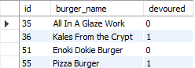

# Eat Da Burger!
[](https://opensource.org/licenses/MIT)
[](https://github.com/jessicablank/eat-da-burger/issues)
[](https://github.com/jessicablank/eat-da-burger/stargazers)


[:hamburger: Deployed on Heroku: https://secure-shore-09876.herokuapp.com/](https://secure-shore-09876.herokuapp.com/)

## Description:  
 A fan site for the show Bob's Burgers. I invite you to learn more and possibly contribute a random burger or Belcher family member. 

 ## Table of Contents:
* [Project Story](#project-story "Go to project story")
* [Contributing](#contributing "Learn how to contribute")
* [Local Installation](#local-installation-instructions "Guide to install on your machine")
* [File Structure](#file-structure "See full file structure")
* [Technologies Used](#technologies-used "Learn more about integrated technologies")
* [mySQL](#mySQL "Peak inside the table")
* [Questions](#questions "Submit questions to jessicablankemeier@gmail.com")
* [License](#license-info "MIT License")

# Project Story
## MVP
This project started as a coding boot camp assignment for a restaurant application. 
Minimum requirements:
- User inputs the name of the burger they would like to eat.
- All inputted burgers are stored in a mySQL database. 
- When a user submits a burger's name, the burger will be displayed on the left side of the page waiting to be devoured. 
- Each waiting burger will have a `devour it!` button. When the user clicks the button, the burger will move the right side of the page. 

The reason it's called "Coding Boot Camp" and not "Coding Fun Times" is because the course moves _fast_. We would learn a new concept and submit a homework assignment using those concepts a few days later. My homework submissions often just met the Minimum Viable Product (MVP) requirements. In this case, we had just _barely_ learned how to integrate a mySQL back-end with a Node Handlebars.js front-end. I received an "A" on the assignment, but the user interface was not appealing (see picture below).

After boot camp classes ended, I decided to take some time to go back to improve my favorite assignments. This was my first refactoring project. 

Original Submission. Yawn.


## CRUD
The first improvement for this homework assignment was to add full database functionality. The MVP I submitted did not have a "delete" function. The refactored application had full database operation capabilities:
 - CREATE: Order a burger
 - READ: The burger will appear in the "Burgers Ready to Be Devoured" column by default. Once updated, the burger may appear in the "mmm..Devoured Burgers" column.
 - UPDATE: The user can move the burger between columns via the `Devour It` and `Make It Again` buttons.
 - DELETE: The user can delete the burger from the database via the `Send It Back!` and `X` buttons. 

I saw the value of a client-side delete function almost immediately. I won't record the inappropriate (but hilarious) burger name I discovered all over my project on a Wednesday morning. You can ask me via email.

I also updated the styling and added pictures from Bob's Burgers. I showed the project to my friends to test it. They were stumped. 

I thought the "Burger of the Day" art images would inspire users to type a clever burger name. Instead, the burger names on the images were difficult to read and intimidated the users. Users felt pressure to come up with a clever burger name on their own. Watching the users struggle also showed me that every time the page refreshed to move a burger, the images flashed awkwardly. Back to refactoring.


 ## FINAL

I created a random burger generator and styled it to look like the iconic chalkboard from the show. I added functionality for users to either type their own burger name or click to order the burger from the _Burger of the Day_ board. During this process I added a little Easter Egg to the console because I am a new developer and I find console messages magical. :sparkles:

To test these updates, I texted the app link to a friend and his response was "I love this!" Phew! I asked a few other friends to test and received positive feedback. I feel good about letting this be the final version (for now).


## FINAL IN ACTION:


## Easter Egg - Shhhhhh...


    
# Contributing
I invite you to contribute Random Burgers from the show for the _Burger of the Day_ board. The `RandomBurgerNames` array is in the **randomBurger.js** file. Please keep the names in alphabetical order. 

In the same file, there is also a `belcherNames` array available for contributions to the console Easter Egg.

I will be reviewing all of the submissions proposed through Pull requests. I would like to keep these clean, fun, and related to the show. 

# Local Installation Instructions
Clone the repo and install dependencies in terminal using `npm i`

You can use `npm start` to get the app running on localhost:8080

# File Structure
This project uses a custom Object Relational Mapper(ORM) to connect the code to the mySQL database. 
```
├── config
|  ├── connection.js
|  └── orm.js
├── controllers
|  └── burgersControllers.js
├── db
|  ├── schema.sql
|  └── seeds.sql
├── models
|  └── burger.js
├── package-lock.json
├── package.json
├── public
|  └── assets
|     ├── css
|     |  └── style.css
|     ├── img
|     |  ├── BurgerFamily.jpg
|     |  └── favicon.ico
|     └── js
|        ├── burgers.js
|        └── randomBurger.js <~*-^-^-~Contribute Here!!~-^-^-*~>
├── README.md
├── screenshot.PNG
├── screenshotv2.PNG
├── screenshotv3.PNG
├── server.js
└── views
   ├── index.handlebars
   ├── layouts
   |  └── main.handlebars
   └── partials
      └── burgers
         └── burger-block.handlebars
```
# Technologies Used
- [BootStrap](https://getbootstrap.com/docs/4.0/getting-started/introduction/)
- [jawsDB](https://www.jawsdb.com/)
- [NPM HandleBars](https://www.npmjs.com/package/handlebars)
- [NPM MySQL](https://www.npmjs.com/package/mysql)
- [NPM Express](https://www.npmjs.com/package/express)
- [NPM Express-HandleBars](https://www.npmjs.com/package/express-handlebars)

# mySQL
Upon creation, the burgers receive a unique id and are by default "not devoured".  

Schema:
```
CREATE TABLE burgers
(
	id int NOT NULL AUTO_INCREMENT,
	burger_name  varchar(255) NOT NULL,
	devoured BOOLEAN DEFAULT false,
	PRIMARY KEY (id)
);
```
When the user clicks the `Devour It!` button, the burger's devoured state changes to `true`.

Example Table:




# Questions
You can reach the author, Jessica Blankemeier via [jessicablankemeier@gmail.com](mailto:jessicablankemeier@gmail.com)


# License
Copyright 2020 - present Jessica Blankemeier.
This project is licensed under the terms of the MIT license. 
This page has no license or affiliation with Fox entertainment and is for fan fun use only. 
More information is available at [opensource.org/licenses](https://opensource.org/licenses/MIT)

[Back to Top](#table-of-contents)